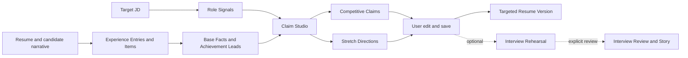

# AI Job Copilot Design Contract

Status: Active for new product work
Last reviewed: 2026-08-10

This document is the stable development contract for AI Job Copilot. It explains how product behavior and architecture should evolve. Feature backlogs belong in GitHub Issues; individual durable decisions belong in `docs/adr/`.

## Product contract

AI Job Copilot helps a candidate prepare one targeted application by excavating, strengthening, and selecting job-relevant claims, with optional interview rehearsal from a selected claim.

The product begins with concrete JD text and produces a Targeted Resume Version. The candidate may optionally continue from a selected claim into Interview Rehearsal and a reusable Interview Story. It does not decide the candidate's long-term career direction, screen candidates for an employer, predict hiring probability, or submit applications automatically.

## Core workflow



The primary interaction is not a score report or an interview. It identifies a promising experience, produces a usable Competitive Claim, and presents a separate Stretch Direction that the user may use, edit, or ignore before rehearsal.

## Product invariants

1. No external evidence audit is required in the primary workflow.
2. Candidate-provided facts are accepted as working input without claiming external verification.
3. Stronger wording may change selection, structure, emphasis, and role-language translation; it may not silently change material history.
4. Missing responsibility, technology, scale, causality, or outcome becomes an Expression Gap inside a Stretch Direction or an Open Detail, not a forced question or invented fact.
5. A Competitive Claim uses only current Base Facts. A Stretch Direction may name a missing dimension and its potential value, but it is never rendered as a second factual Resume Claim.
6. The user can inspect, edit, mix, accept, or reject proposed wording.
7. Interview preparation begins from the exact claim the user selected.
8. P0 generates no match score, aggregate coverage score, interview probability, or hiring probability. Legacy score-based records may remain read-only during migration but never enter new Target Application state.
9. Each Competitive Claim has at most one Stretch Direction: the expansion opportunity with the highest expected value for the Target Application.
10. One analysis returns at most three Competitive Claims, ranked by expected impact on the Target Application. Return fewer when the source material does not support three useful claims.
11. P0 claims originate only from Experience Items: standalone projects or coherent project, responsibility, or outcome units inside an internship or full-time Experience Entry. The entry supplies inherited context but never replaces the item as the claim source. Summary, skills, and education may inform context but never become standalone claim sources.
12. Every claim card exposes its source Experience Item, one primary Role Signal, the Competitive Claim, and its single Stretch Direction. This is transformation traceability, not external evidence verification.
13. User-edited claim text becomes the selected Resume Claim immediately. Editing never triggers an automatic model call, regeneration, or replacement; any re-analysis requires an explicit user action.
14. Claim completion never questions the user. Interview Rehearsal is a separate, optional state where the system asks adaptive follow-ups from the selected Resume Claim and prior answers.
15. Interview Rehearsal has no fixed turn count or user-facing end action. The AI decides whether another useful follow-up remains; silence requires no state mutation. Interview Review is generated only after an explicit user request.
16. Continue Interview Rehearsal only when another question is expected to materially improve story completeness or coherence across context, personal role, action or decision, result or limitation, and the primary Role Signal.
17. Interview Review contains qualitative, answer-grounded feedback only: what is clear, likely follow-up gaps, a 60-second Interview Story, and one highest-value improvement. It never returns an overall score, interview probability, or hiring probability.
18. Every Role Signal declares its source. An explicit signal links to JD wording; an inferred signal is labeled as interpretation and includes a short rationale. Neither is presented as recruiter truth.
19. Rank Competitive Claim opportunities independently of Experience Item diversity. One Experience Item may produce multiple claims when each has a distinct source focus or primary Role Signal; semantic duplicates are prohibited.
20. Competitive Claim generation may compress, reorder, translate into job language, and strengthen a verb only when current Base Facts entail the action. It may not upgrade ownership, causality, technology, scale, or outcome into a new material-fact category.
21. P0 Targeted Resume Version is an owner-scoped collection of selected or edited Resume Claims and their source, Role Signal, and interview links. It is not a complete resume template, layout system, or PDF editor.
22. Describe current insufficiency only as an Expression Gap attached to a Stretch Direction: what the source wording does not communicate clearly for the primary Role Signal. Never infer a Capability Gap or produce a separate deficiency report.
23. P0 Claim Studio requires concrete JD text. A role title or generic position profile may support browsing but cannot substitute for the Target Application input.
24. P0 may learn a Writing Preference Profile only from differences in Resume Claims the user explicitly saves. The profile is owner-scoped, inspectable, editable, disableable, clearable, and restricted to style; it cannot change material-fact rules.
25. Every personalized generation records the Writing Preference Profile snapshot it used. A new user or disabled profile uses the versioned default so evaluations remain reproducible.
26. P0 stores reusable Experience Items and Base Facts in an owner-scoped Experience Library whose default user experience is current saved content, not version management.
27. Claim edits and Interview Rehearsal answers may create Fact Update Proposals, but only an explicit user action saves them to the Experience Library. Resume import remains application-local unless the user chooses the same action.
28. Whenever application-local or Experience Library content is used for claim generation, the Target Application captures a read-only Source Snapshot. Later source edits never rewrite that snapshot. P0 exposes no fact approval state, hash gate, or `Draft/Saved/Superseded` lifecycle. See ADR-0003.
29. Experience Entry and Experience Item form a two-level model, not a dossier system. Import may propose item boundaries, but the user can correct grouping. Claim Studio receives item-level Base Facts plus inherited entry context and never treats a multi-project employment entry as one undifferentiated source. See ADR-0004.
30. Editing current Experience Item or Base Fact content after generation never regenerates, replaces, or invalidates an existing claim. The product shows a non-blocking Source Change Notice and waits for explicit re-analysis before it calls the model with updated source or captures a new Source Snapshot. See ADR-0005.

## Claim Studio output

| Artifact | Purpose | Allowed change | Prohibited shortcut |
| --- | --- | --- | --- |
| `Competitive Claim` | Default workspace and strongest currently usable claim | Strengthen ownership, difficulty, scope, and impact from current Base Facts | Turning participation into sole ownership, correlation into causation, or a missing detail into prose |
| `Stretch Direction` | Help the user see the single most valuable way the claim could improve | Name one Expression Gap, explain why it matters for the Target Application, and illustrate the shape of a stronger claim without asserting the detail | Presenting a hypothetical responsibility, metric, technology, or result as candidate history; calling the Expression Gap a candidate deficiency; returning a generic checklist of directions |

The two artifacts are not expression levels or tone options. One is usable resume content; the other is optional guidance for the user's own thinking.

## System shape

```text
Next.js interaction
        ↓
FastAPI transport
        ↓
Application Studio module
        ├── workflow state and transitions
        ├── prompt orchestration
        ├── structured output validation
        └── persistence coordination
        ↓
Model adapter + SQLAlchemy adapter
```

### Application Studio module

New product behavior belongs behind one deep module. Its external interface should accept a command and return the complete current snapshot needed by the caller:

```text
execute(command) -> ApplicationSnapshot
```

The command may start an application, select current Experience Library items, add or edit an application-local Base Fact, explicitly save a Fact Update Proposal to the library, run analysis or re-analysis, select or edit a claim, save a Targeted Resume Version, request its text/Markdown export, inspect or change the Writing Preference Profile, submit an interview response, or request an Interview Review. The snapshot contains the workflow phase, captured source content and provenance, any Source Change Notices, Role Signals, Base Facts, Competitive Claims, Stretch Directions, user decisions, the saved Targeted Resume Version, the active preference state and generation snapshot, and Interview Rehearsal or Review state that the caller is allowed to see.

Route handlers, React pages, and tests should use this interface rather than reproducing workflow rules. Model prompting, retries, state transitions, and persistence order remain implementation details of the module.

Application Studio is a deterministic product workflow, not an autonomous Agent Loop. Product code owns the allowed commands, phase transitions, persistence order, retries, and failure recovery. The model cannot choose arbitrary tools or reorder the workflow. See [ADR-0001](./docs/adr/0001-deterministic-application-workflow.md).

The workflow owns four independently versioned prompt families:

1. `Target Analysis` requires concrete JD text, extracts at most three primary Role Signals, and can be cached; return fewer rather than padding the result. Every signal includes an explicit JD excerpt or an inferred-source label with a short rationale.
2. `Claim Studio` selects up to three claim opportunities across Experience Items and returns their Competitive Claims and Stretch Directions in one structured response. One Experience Item may contribute multiple non-duplicative opportunities.
   It may apply the active Writing Preference Profile to style, never to fact boundaries.
3. `Interview Rehearsal` produces one next question or a stop decision for each answered turn.
4. `Interview Review` produces qualitative feedback only after an explicit user command.

### Adapters and seams

- The model provider is a true external dependency. Inject a model port; use an OpenAI-compatible adapter in production and a deterministic fake adapter in tests.
- SQLAlchemy is the persistence implementation. Keep transaction rules inside the module rather than spreading them across route handlers.
- SSE or another streaming transport is presentation infrastructure. It must not own application state transitions.
- Do not introduce a new adapter until production and test behavior genuinely need different implementations.

## State and persistence

Chat messages are useful history, but they are not the canonical product state.

For the first vertical slice, keep the current reusable Experience Entries, Experience Items, and Base Facts in normalized, owner-scoped Experience Library records. Imported drafts remain in their current application until explicitly saved to the library. One validated application snapshot captures the source content used and contains the rest of the Target Application state:

- target role and JD reference;
- source resume text or a private reference to it;
- selected Experience Entry and Experience Item IDs, captured Base Facts, inherited entry context, and source locations;
- the Writing Preference Profile snapshot used for generation;
- workflow phase;
- Role Signals and Achievement Leads;
- Base Facts and Open Details;
- generated Competitive Claims and their separate Stretch Directions;
- user selections and edits;
- pending Fact Update Proposals;
- Source Change Notices relating current content to the snapshots behind existing claims;
- Interview Rehearsal and Review state;
- prompt/model version metadata required for evaluation.

Only two P0 product states are normalized beyond the application snapshot: the Experience Library for cross-application source reuse and the owner-scoped Writing Preference Profile for inspectable style reuse and controls. Historical source stability comes from the Source Snapshot inside each Target Application, and every personalized generation stores the preference snapshot it used. An implementation may use opaque internal snapshot identifiers, but P0 does not need fact revision browsing, restoration, approval states, or content hashes. Do not design additional speculative tables before real query, concurrency, retention, or reporting needs justify them. See [ADR-0003](./docs/adr/0003-use-application-source-snapshots.md).

Every persisted object must carry or inherit user ownership. Database changes use forward Alembic migrations and remain compatible with SQLite development and PostgreSQL deployment.

## Frontend interaction contract

- Keep the target JD, current Achievement Lead, prioritized Stretch Directions, and emerging claims visible in one primary workspace.
- Recommend concise Stretch Directions without requiring the user to answer them before editing, accepting, or exporting the current claim.
- Present the Competitive Claim as the primary editable content and the Stretch Direction as visually distinct guidance; never make them look like equivalent resume versions.
- Prioritize no more than three claim cards in one analysis; do not pad the result with low-value rewrites to meet a quota.
- Keep the source Experience Item and primary Role Signal inspectable beside each claim so the user can understand why it was selected and what changed.
- Export the Targeted Resume Version as copyable text or Markdown in P0; do not introduce resume templates, layout editing, or PDF composition into the thin slice.
- Make the generated claim, user edits, and separate Stretch Direction visually distinguishable without presenting them as expression levels.
- Never hide an Open Detail inside polished prose.
- Treat the selected claim as editable text, not a locked model answer.
- Save user edits without automatically regenerating the claim or its Stretch Direction. A future re-analysis control must be explicit.
- When a source changes after generation, keep the existing claim visible and editable, show a concise Source Change Notice, and offer explicit re-analysis without presenting the claim as updated.
- Keep Interview Rehearsal in the same Target Application while giving it a distinct interaction state; it may question the user, but claim completion may not.
- Provide explicit loading, retry, provider-unavailable, and partial-save states.

## AI behavior contract

Each model-backed node must have one observable responsibility:

1. Role Signal extraction identifies the few signals that matter to this application.
2. Achievement Lead discovery finds candidate experiences worth expanding.
3. Stretch Direction ranking selects exactly one highest-value Expression Gap per Competitive Claim and explains why it matters without interrogating the user.
4. Claim generation produces one Competitive Claim from validated Base Facts; it does not turn a Stretch Direction into factual wording on the user's behalf.
5. Interview Rehearsal asks one adaptive follow-up at a time from the selected claim, Target Application context, and answers already given, then stops when another question is unlikely to improve story completeness or coherence materially.
6. Interview Review summarizes and critiques the rehearsal only when the user explicitly requests it, using structured qualitative feedback rather than a numeric score.

Model output must be validated before it reaches persistence or UI state. Invalid output is retried or returned as a recoverable failure; it is never silently coerced into plausible content.

Prompt changes must be attributable to a version in evaluation artifacts. Deterministic tests use a fake adapter and do not call paid models.

## Privacy and security contract

- Resumes, JDs, answers, claims, conversations, and application outcomes are private user data.
- Collect and retain only what the workflow requires.
- Scope reads, writes, exports, and deletes to the authenticated owner.
- P0 behavior events such as claim adoption, editing, Stretch Direction use, and Interview Review requests remain owner-scoped in the user's account or self-hosted instance.
- Writing Preference Profiles and their source edit events remain owner-scoped. Users can inspect, disable, edit, and clear the profile without affecting saved claims.
- Do not automatically upload resumes, JDs, claims, answers, events, or allegedly de-identified derivatives to a central service. Shared evaluation data requires per-case authorization, user-initiated export, and manual de-identification.
- Keep credentials and model keys outside version control.
- Disclose when content is sent to a configured third-party model provider.
- A provider failure must not corrupt or discard already persisted user state.

## Evaluation contract

Engineering checks establish behavior; they do not establish market demand or hiring impact.

The primary P0 product event metric is `Saved Claim Rate`: among successful analyses that return at least one Competitive Claim, the share where the user explicitly saves at least one claim into the Targeted Resume Version. Editing before save still counts; browsing, dwell time, or model generation alone does not. This metric measures observable adoption behavior, not claim usefulness.

The first 10-user cohort establishes a descriptive Saved Claim Rate baseline. Do not invent an absolute pass threshold from that sample. Subsequent prompt or UI versions are compared against the baseline while monitoring semantic edit distance, content-quality evaluation, and silent material-fact additions.

Evaluate the core nodes with:

- useful Base Facts the user voluntarily adds after seeing a Stretch Direction;
- time to first adopted Resume Claim;
- Stretch Directions viewed or used per adopted claim;
- blind preference against the original and a generic AI baseline;
- Saved Claim Rate, copy/export events, and semantic edit distance before save;
- user reports of wording being too weak or too strong;
- silent material-fact addition rate;
- Interview Story completion and consistency across follow-ups;
- later, owner-consented application-to-interview outcomes within comparable cohorts.

For Competitive Claim generation, the controlled AI baseline uses the same model, generation parameters, resume, and Target Application input with a generic one-shot instruction to improve the experience for the JD. The experiment changes only the AI Job Copilot prompt and workflow. Keep the original resume wording as a non-AI reference; do not attribute gains to the workflow when the model also changed.

Use a strong-model pairwise judge for high-frequency prompt regression with randomized, source-blind ordering and a versioned rubric. The judge remains a proxy and may not approve a stage release alone. Stage acceptance requires blind review by real candidates and reviewers with relevant hiring or recruiting experience. Calibrate proxy agreement against those human decisions and report disagreement rather than hiding it in a composite score.

Thresholds and experiment design live in `docs/PRODUCT_DEFINITION.md`. Results must state dataset, evaluator, version, sample size, and limitations.

## Change protocol

- A new domain term updates `CONTEXT.md`.
- A stable cross-feature constraint updates this document.
- A durable contested decision creates an ADR.
- A feature requirement or implementation plan becomes a GitHub Issue.
- A temporary experiment stays in the issue or evaluation artifact and does not become a design invariant until accepted.

When implementation and this contract disagree, do not silently copy existing behavior. Determine whether the implementation is transitional or the contract should be amended, and record a durable decision when the answer affects future work.
