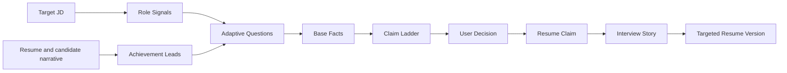

# AI Job Copilot Design Contract

Status: Active for new product work
Last reviewed: 2026-08-10

This document is the stable development contract for AI Job Copilot. It explains how product behavior and architecture should evolve. Feature backlogs belong in GitHub Issues; individual durable decisions belong in `docs/adr/`.

## Product contract

AI Job Copilot helps a candidate prepare one targeted application by excavating, strengthening, selecting, and rehearsing job-relevant claims.

The product begins with a concrete target role or JD and ends with a Targeted Resume Version plus reusable Interview Stories. It does not decide the candidate's long-term career direction, screen candidates for an employer, predict hiring probability, or submit applications automatically.

## Core workflow



The primary interaction is not a score report. It is a short cycle of identifying a promising experience, asking the most valuable next question, comparing expression strengths, and rehearsing the selected claim.

## Product invariants

1. No external evidence audit is required in the primary workflow.
2. Candidate-provided facts are accepted as working input without claiming external verification.
3. Stronger wording may change selection, structure, emphasis, and role-language translation; it may not silently change material history.
4. Missing responsibility, technology, scale, causality, or outcome becomes a Clarifying Question or Open Detail, not an invented fact.
5. `Steady`, `Competitive`, and `Stretch` claims share one Base Fact set.
6. The user can inspect, edit, mix, accept, or reject proposed wording.
7. Interview preparation begins from the exact claim the user selected.
8. Match scores, if retained as secondary diagnostics, are never presented as interview or hiring probabilities.

## Claim Ladder

| Level | Purpose | Allowed change | Prohibited shortcut |
| --- | --- | --- | --- |
| `Steady` | Fast, low-risk wording | Structure, clarity, job language | Expanding responsibility or adding metrics |
| `Competitive` | Default market-facing wording | Stronger ownership, difficulty, scope, and impact when supported by Base Facts | Turning participation into sole ownership or correlation into causation |
| `Stretch` | Strongest defensible candidate | Surface the strongest framing and the one missing detail that would support it | Silently filling the missing detail |

Expression strength is not the same as formal, casual, or technical tone. It controls the strength of responsibility, causality, and impact claims.

## System shape

```text
Next.js interaction
        ↓
FastAPI transport
        ↓
Application Studio module
        ├── workflow state and transitions
        ├── prompt orchestration
        ├── structured output validation
        └── persistence coordination
        ↓
Model adapter + SQLAlchemy adapter
```

### Application Studio module

New product behavior belongs behind one deep module. Its external interface should accept a command and return the complete current snapshot needed by the caller:

```text
advance(command) -> ApplicationSnapshot
```

The command may start an application, answer a question, select or edit a claim, or submit an interview response. The snapshot contains the workflow phase, Role Signals, Base Facts, next question, claim candidates, user decisions, and Interview Story state that the caller is allowed to see.

Route handlers, React pages, and tests should use this interface rather than reproducing workflow rules. Model prompting, retries, state transitions, and persistence order remain implementation details of the module.

### Adapters and seams

- The model provider is a true external dependency. Inject a model port; use an OpenAI-compatible adapter in production and a deterministic fake adapter in tests.
- SQLAlchemy is the persistence implementation. Keep transaction rules inside the module rather than spreading them across route handlers.
- SSE or another streaming transport is presentation infrastructure. It must not own application state transitions.
- Do not introduce a new adapter until production and test behavior genuinely need different implementations.

## State and persistence

Chat messages are useful history, but they are not the canonical product state.

For the first vertical slice, one owner-scoped application session with a validated JSON snapshot is sufficient. The snapshot should include:

- target role and JD reference;
- source resume text or a private reference to it;
- workflow phase;
- Role Signals and Achievement Leads;
- Base Facts and Open Details;
- generated claims grouped by expression strength;
- user selections and edits;
- Interview Story and follow-up state;
- prompt/model version metadata required for evaluation.

Normalize this state into additional tables only when real query, concurrency, retention, or reporting needs justify it. Do not design a large speculative schema before the vertical slice is validated.

Every persisted object must carry or inherit user ownership. Database changes use forward Alembic migrations and remain compatible with SQLite development and PostgreSQL deployment.

## Frontend interaction contract

- Keep the target JD, current Achievement Lead, current question, and emerging claims visible in one primary workspace.
- Ask one question at a time and explain why it is useful when the reason is not obvious.
- Show expression levels side by side or through an equally comparable control.
- Highlight material wording changes between levels.
- Never hide an Open Detail inside polished prose.
- Treat the selected claim as editable text, not a locked model answer.
- Keep interview rehearsal in the same workflow rather than opening an unrelated generic chat.
- Provide explicit loading, retry, provider-unavailable, and partial-save states.

## AI behavior contract

Each model-backed node must have one observable responsibility:

1. Role Signal extraction identifies the few signals that matter to this application.
2. Achievement Lead discovery finds candidate experiences worth expanding.
3. Question selection chooses the next question with the highest expected information value.
4. Claim generation produces all expression levels from the same Base Facts.
5. Interview rehearsal generates and evaluates follow-ups from the selected claim.

Model output must be validated before it reaches persistence or UI state. Invalid output is retried or returned as a recoverable failure; it is never silently coerced into plausible content.

Prompt changes must be attributable to a version in evaluation artifacts. Deterministic tests use a fake adapter and do not call paid models.

## Privacy and security contract

- Resumes, JDs, answers, claims, conversations, and application outcomes are private user data.
- Collect and retain only what the workflow requires.
- Scope reads, writes, exports, and deletes to the authenticated owner.
- Keep credentials and model keys outside version control.
- Disclose when content is sent to a configured third-party model provider.
- A provider failure must not corrupt or discard already persisted user state.

## Evaluation contract

Engineering checks establish behavior; they do not establish market demand or hiring impact.

Evaluate the core nodes with:

- usable Base Facts recovered per question;
- time to first adopted Resume Claim;
- questions required per adopted claim;
- blind preference against the original and a generic AI baseline;
- user adoption and semantic edit distance;
- user reports of wording being too weak or too strong;
- silent material-fact addition rate;
- Interview Story completion and consistency across follow-ups;
- later, owner-consented application-to-interview outcomes within comparable cohorts.

Thresholds and experiment design live in `docs/PRODUCT_DEFINITION.md`. Results must state dataset, evaluator, version, sample size, and limitations.

## Change protocol

- A new domain term updates `CONTEXT.md`.
- A stable cross-feature constraint updates this document.
- A durable contested decision creates an ADR.
- A feature requirement or implementation plan becomes a GitHub Issue.
- A temporary experiment stays in the issue or evaluation artifact and does not become a design invariant until accepted.

When implementation and this contract disagree, do not silently copy existing behavior. Determine whether the implementation is transitional or the contract should be amended, and record a durable decision when the answer affects future work.
