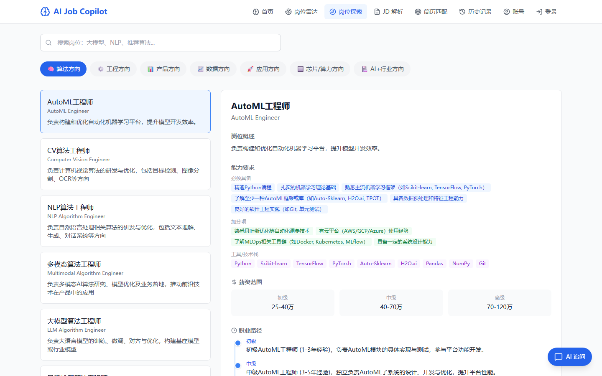
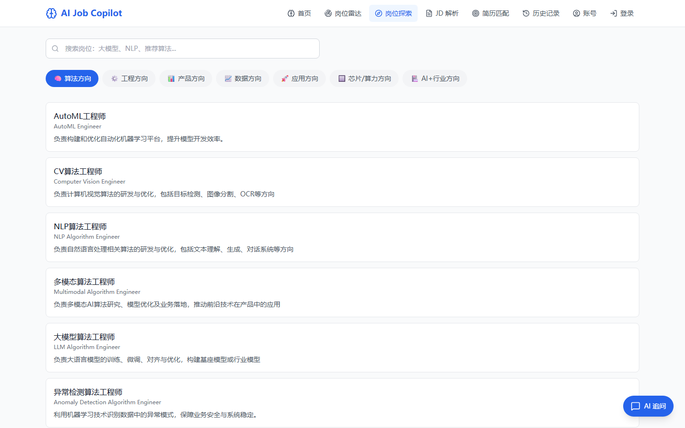
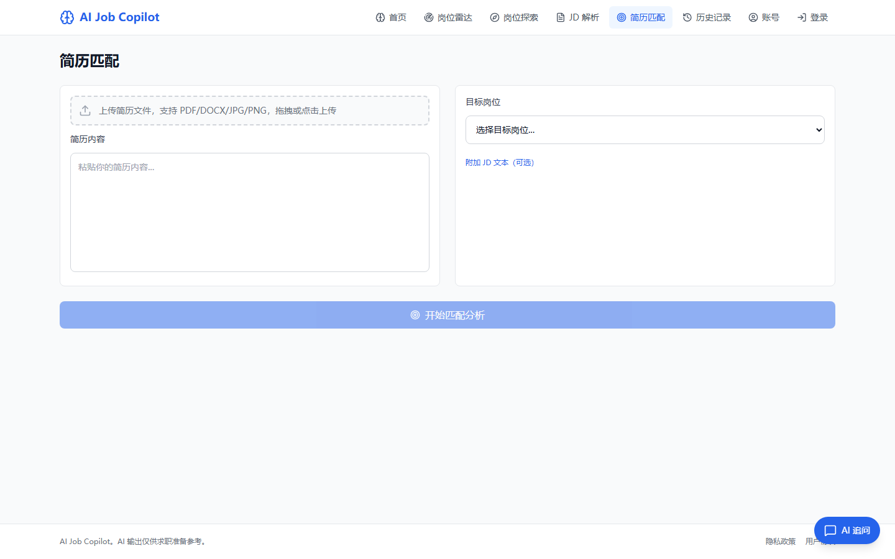

<p align="center">
  
</p>

<h1 align="center">AI Job Copilot</h1>

<p align="center">为 AI 岗位求职准备的全栈工作台</p>

<p align="center">
  <a href="#产品工作流">产品工作流</a> ·
  <a href="#核心界面">核心界面</a> ·
  <a href="#本地运行">本地运行</a> ·
  <a href="#验证">验证</a>
</p>

投递一个职位前，岗位信息、原始 JD、简历版本和修改判断常常散在不同地方。AI Job Copilot 把这些材料放进一个工作区，让用户先理解目标岗位，再把经历与岗位要求逐项对照，并把后续追问与报告保存到个人历史中。

项目提供求职准备所需的分析和整理能力。它不替招聘方筛选候选人，匹配结果也不构成录用预测。

产品从一个明确岗位或具体 JD 开始，服务一轮投递准备；它不根据简历替用户预测职业方向，也不提供长期职业路线规划。

## 产品工作流

<table>
  <tr>
    <td width="50%" valign="top">
      <strong>01　岗位资料</strong><br />
      查询 46 个结构化 AI 岗位样例。每个岗位提供能力要求、职业路径、薪资样例和相关 JD，作为具体投递前的背景资料。
    </td>
    <td width="50%" valign="top">
      <strong>02　JD 解析</strong><br />
      粘贴目标 JD，整理显性要求、隐含要求和面试准备点，并把目标岗位带入简历匹配。
    </td>
  </tr>
  <tr>
    <td width="50%" valign="top">
      <strong>03　简历匹配</strong><br />
      上传或粘贴简历，选择目标岗位后生成匹配分项、已有证据、能力差距和改写、面试准备建议。
    </td>
    <td width="50%" valign="top">
      <strong>04　追问与留档</strong><br />
      围绕一次 JD 或匹配结果继续提问。账户中的历史页支持回看、导出和删除个人分析记录。
    </td>
  </tr>
</table>

## 核心界面

<p align="center">
  
  
</p>

岗位资料页用于补齐目标岗位的背景信息。用户可以按岗位分类或关键词查询，进入岗位详情后查看能力标签、样例薪资、职业路径和关联 JD。简历匹配页接受文本和文件材料，并要求用户明确目标岗位和可选的 JD 上下文。

## 实现范围

| 层级 | 内容 |
| --- | --- |
| 产品界面 | Next.js 14、React、TypeScript、TanStack Query 和 Tailwind CSS |
| 服务端 | FastAPI、SQLAlchemy async、Alembic、Pydantic Settings 和鉴权接口 |
| 求职能力 | 岗位资料、JD 分析、简历匹配、上下文追问、报告导出、历史与账户管理 |
| 文件处理 | PDF、DOCX 和图片文件的解析入口，上传类型与大小限制 |
| 数据与交付 | SQLite 开发库、PostgreSQL 配置、Docker Compose、Caddy、Render 和 Railway 配置 |

```text
浏览器
  ↓
Next.js 前端
  ↓
FastAPI API ── 结构化岗位数据与账户记录
  ↓
兼容 OpenAI 的模型服务或 GLM 配置
```

## 仓库结构

```text
backend/     FastAPI、数据模型、迁移和后端测试
frontend/    Next.js 界面与 Playwright 测试
data/        版本化的岗位资料和 JD 样本
scripts/     数据入库、迁移、检查和发布验收工具
deploy/      Caddy 与数据库备份脚本
docs/        测试、部署、迁移和合规说明
```

本地数据库、虚拟环境、前端依赖和构建缓存均由开发过程生成，不进入版本控制。

## 本地运行

需要 Python 3.11 或更高版本，以及 Node.js 20 或更高版本。

```powershell
git clone https://github.com/LittleNuB/ai-job-copilot.git
cd ai-job-copilot
```

启动后端。

```powershell
.\start-backend.bat
```

脚本会创建 `backend/.venv`、安装后端依赖、执行数据库迁移、写入岗位资料，并启动 `http://127.0.0.1:8000`。

另开一个终端启动前端。

```powershell
.\start-frontend.bat
```

浏览器打开 `http://localhost:3000`。开发代理会把 `/api/*` 转发给本机后端。

## 模型与数据边界

JD 分析、简历匹配、语义检索和图片文字识别需要模型服务。复制配置文件后填入自己的兼容 OpenAI 服务信息，已有 GLM 配置也可继续使用。

```powershell
Copy-Item .env.example .env
```

新配置使用 `LLM_PROVIDER`、`LLM_API_KEY`、`LLM_CHAT_MODEL` 和 `LLM_BASE_URL`。密钥只保存在本机 `.env`，不应提交到仓库。

- SQLite 数据库由本地启动过程生成，不提交到仓库；版本化的岗位资料和 JD 样本位于 `data/`。
- 简历、JD 和追问内容可能会发送给用户配置的第三方模型服务，提交前应移除不必要的个人信息。
- 用户数据查询、导出与删除接口要求登录，并按账户隔离。
- 项目不读取浏览器登录状态，也不包含任何模型服务密钥。

## 验证

仓库包含后端回归测试、前端类型检查、lint 和 Playwright E2E。

```powershell
.\scripts\check_all.ps1
.\scripts\check_all.ps1 -E2E -StartServices
```

运行中的 API 可以使用下面的脚本检查健康状态、岗位数据、鉴权边界和文件上传保护。

```powershell
python .\scripts\smoke_api.py --base-url http://127.0.0.1:8000
```

## 部署

仓库提供 Docker Compose、Caddy、Render 与 Railway 配置，可用于本地或受控环境部署。部署前需要重新设置 HTTPS、CORS、JWT 密钥、数据库和模型服务参数。

进一步说明：

- [测试与质量检查](./docs/TESTING.md)
- [部署说明](./docs/DEPLOYMENT.md)
- [数据库迁移](./docs/DATABASE_MIGRATIONS.md)
- [数据与合规边界](./docs/COMPLIANCE_GAPS.md)

## License

MIT
