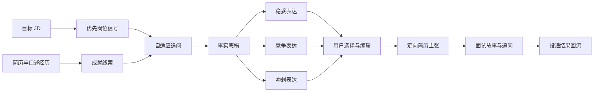

# AI Job Copilot Product Definition

Status: Proposed v0.2 for owner review
Date: 2026-08-09

Research basis: [Competitive Capability Matrix](./COMPETITIVE_CAPABILITY_MATRIX.md)

## Decision summary

AI Job Copilot 是一个面向**具体中文 AI 岗位投递**的经历挖掘与表达增益工作台。它不审计用户有没有做过某件事，而是接受用户陈述作为工作底稿，通过少量追问，把容易被低估的职责、难度、规模、决策与结果挖出来，再写成招聘方能迅速识别的价值。

本版相对 v0.1 作出五项方向调整：

1. 外部证据、材料核验和“能力缺口证明”退出主流程。
2. 产品目标由“判断是否覆盖 JD”改为“把已有经历表达得更强、更相关、更具体”。
3. 用户自己陈述的事实默认被接受；系统不要求上传仓库、工作文档或结果证明。
4. 系统允许积极重构与合理推断，但不悄悄补造新的职责、技术、数字或业务结果。遇到这类信息时只做一次短追问，或留下可编辑占位。
5. 评测重点从抽取准确率和覆盖分，转向经历挖掘效率、表达增益、用户采纳、面试可讲述性和真实投递结果。

这里的产品立场不是“越保守越真实”，而是：

> 在候选人能够自然讲清楚的边界内，把一段经历包装到尽可能强。

## Product boundary

一次产品任务称为 **Target Application（目标投递）**：

- 开始：用户已经拥有一个具体岗位或一份具体 JD。
- 输入：JD、现有简历，以及用户用文字或语音补充的个人经历。
- 结束：形成一份 Targeted Resume Version，包含可直接使用的简历主张、可复用的面试故事和少量仍待用户填写的开放细节。

产品不负责：

- 要求用户提交外部材料证明经历；
- 替招聘方核验候选人或做背景调查；
- 根据简历预测适合什么职业；
- 设计长期学习或转型路径；
- 预测面试或录用概率；
- 自动提交职位申请。

方向探索、角色尝试和长期能力建设属于寻径星图，不进入这个仓库。

## User and job to be done

### 首要用户假设

正在申请中文 AI 产品、算法、应用工程、数据或相关岗位，已有一些真实工作或项目经历，但原始简历停留在“负责什么”，不会主动呈现为什么难、自己做了什么判断、影响了谁、结果有多大，也不知道怎样把内部语言翻译成目标岗位认可的能力信号。

这仍是待验证的用户假设，不是已经证明的市场结论。

### Job to be done

> 当我准备申请一个具体 AI 岗位时，帮我从平淡、零散的经历里挖出值得卖的部分，用最少的追问补齐关键细节，并给我一组从稳妥到进取的表达，让我快速选出最有竞争力且面试时讲得下去的版本。

## Product thesis

AI 简历润色、JD 匹配、成就量化和对话挖掘都已经有竞品。AI Job Copilot 不能靠“会润色”或“会追问”获得差异化。

当前值得验证的产品假设是：

> 求职者缺的不是一句更漂亮的文案，而是一套能把同一段普通经历逐层增益、让用户掌控表达力度、并把最终主张直接变成面试故事的工作流。

产品优化目标可以写成：

`表达收益 = 岗位相关性 × 具体度 × 影响力 × 可讲述性 − 无意新增事实的风险`

这不是科学评分公式，而是产品取舍：包装不能只追求辞藻强度，也要让用户在招聘方连续追问时仍能展开细节。

## Core product model

产品围绕一条 **Claim Ladder（主张阶梯）** 工作：

### 三档表达强度

| 模式 | 适用场景 | 允许的增益 | 不做的事 |
| --- | --- | --- | --- |
| 稳妥 | 用户希望快速完成、细节记不清 | 改结构、换招聘语言、突出已明确结果 | 扩大责任边界或补充数字 |
| 竞争 | 默认模式 | 强化主导性、难度、范围与业务价值；对缺失细节做短追问 | 把参与写成独立负责；把相关性写成因果 |
| 冲刺 | 高竞争岗位、用户愿意补充更多信息 | 给出最强合理表述，并明确指出还需用户补哪一个关键细节 | 静默生成新的技术、规模、指标或成果 |

表达强度不是“正式、技术、轻松”这类语气选择，而是对责任、因果和影响的主张力度。三档结果必须来自同一份事实底稿。

### 为什么仍保留轻量边界

产品不要求证明，但要防止模型在改写时擅自把“参与”变成“主导”、把“效果不错”变成虚构百分比。原因不是道德审计，而是产品效果：这类主张最容易在面试追问中断裂，也让用户无法判断 AI 到底改了语言还是改了人生经历。

因此每个新事实只需要用户做轻量选择：补充、修改、跳过。无需上传证明，也不阻止用户以自己的判断接受最终版本。

## Product workflow and output

1. 创建 Target Application，粘贴目标 JD 和现有简历。
2. 系统只挑出最值得影响本次投递的 3–5 个 Role Signals，不生成大而全的缺口报告。
3. 用户用大白话描述相关经历，系统找到最有潜力的 Achievement Leads。
4. 系统按信息价值追问责任、难点、决策、规模、前后变化与结果；每轮只问一个最值得问的问题。
5. 形成可复用的 Base Facts，用户无需提交外部证明。
6. 为每个重点经历生成稳妥、竞争、冲刺三档 Resume Claims，并高亮各版本改变了什么。
7. 用户选择、混合或编辑；系统学习其偏好的表达力度和语言风格。
8. 对选中的主张生成 60 秒 Interview Story 与两轮高概率追问，帮助用户发现讲述断点。
9. 输出 Targeted Resume Version，并记录投递、筛选、面试与结果，供后续版本比较。

首版核心界面应围绕“原始经历—追问—三档主张—面试故事”展开，不再围绕“要求—证据—覆盖分”展开。

## Differentiation

### 已被竞品占据的能力

- AI 简历润色和 bullet 生成；
- ATS 或关键词匹配；
- JD 定向改写；
- 用 STAR、行动动词和量化结果重构经历；
- 对话式经历挖掘；
- 逐条接受或编辑 AI 建议；
- 单独的模拟面试或面试题预测。

### 值得验证的组合差异

1. **主张阶梯，而不是一次改写。** 同一事实底稿展示三档责任与影响表达，并说明增强发生在哪里。
2. **为中文 AI 岗位做语义翻译。** 重点理解 AI 产品、Agent、RAG、评测、模型迭代、数据闭环和跨职能协作中的真实角色信号，而不是只替换通用动词。
3. **追问预算。** 不把用户拖进长访谈，而是优化“每一个问题带来多少可用简历信息”。
4. **简历主张直接连接面试故事。** 不是另开一个通用模拟面试，而是让用户立即检验刚选中的强表述能否被自然展开。
5. **跨投递复用与反馈学习。** 同一事实底稿可以为不同 JD 生成不同版本，并结合用户采纳、编辑和真实投递结果逐步校准。

这是一组可检验的产品组合，不是不可复制的商业壁垒。若要形成壁垒，需要长期积累“什么经历、怎样表达、投向什么岗位、获得什么结果”的脱敏反馈数据。

### 个人开源项目仍可展示的特点

- 面向中文 AI 岗位；
- 自托管与用户自带模型；
- 公开提示词版本、失败案例和生成评测；
- 不用虚假的录用概率或总分制造权威感。

这些特点提升可信度和展示辨识度，但不单独构成市场优势。

## Evaluation and decision gates

### 节点 A：追问是否真的挖出更多可用信息

对同一批脱敏经历分别使用固定表单、通用对话模型和自适应追问策略。人工仅判断新信息是否能实际改善目标岗位的简历主张，不要求外部证明。

核心指标：

- 每个问题新增的可用 Base Facts 数；
- 从开始到第一条可采纳主张的时间；
- 完成一条主张需要的追问数；
- 用户跳过率与中途退出率；
- 责任、难度、规模、决策和结果五类信息的恢复率。

首轮建议门槛：自适应追问相对固定表单，在不增加完成时长的前提下，使“可采纳主张数/问题”提升至少 20%。

### 节点 B：三档改写是否比通用 AI 更强

每个案例产生原简历、通用模型一次性改写和 AI Job Copilot 三档结果。由不了解方案来源的评审者做成对选择，并记录选择原因。

核心指标：

- 岗位相关性、具体度、影响力、自然度与资历信号；
- 相对原文和通用 AI 基线的盲选偏好率；
- 用户直接采纳率、采纳后语义修改幅度；
- 用户认为“太保守”或“夸过头”的比例；
- 模型静默新增职责、技术、数字或结果的比例。

首轮建议门槛：竞争档对通用 AI 基线的盲选偏好率达到 65%，同时静默新增重要事实低于 2%。这些阈值是产品决策线，不是行业标准。

### 节点 C：表达强度是否真的给用户控制感

比较单一最佳答案与三档 Claim Ladder。观察用户是否更快做决定，以及是否更少反复要求“再强一点”或“别写得这么夸张”。

核心指标：

- 首次选择耗时；
- 三档之间的选择分布；
- 重新生成次数；
- 用户手工回退责任或因果表述的次数；
- 同一用户跨多个岗位的稳定偏好。

若三档只增加认知负担、没有降低返工，则改成一个默认版本加“更稳/更强”双向调节。

### 节点 D：简历到面试的桥接是否有效

让用户对选中的 Resume Claim 回答两轮追问。评审只检查其是否能说清背景、个人作用、关键判断、结果和限制，不要求外部材料。

核心指标：

- 60 秒故事完成率；
- 两轮追问后仍能保持前后一致的比例；
- 从演练中补回简历的有效细节数；
- 用户对“我敢不敢在面试中用这句话”的评分变化。

### 节点 E：真实投递是否改善

在用户授权下记录岗位、简历版本、是否过筛、是否面试和最终结果。优先比较同一用户、相近岗位、相近时间窗口内的版本差异，避免把公司、资历和市场差异错误归因于文案。

业务指标：

- 首条可采纳 bullet 的时间；
- 完成并导出率；
- 第二个 JD 的事实底稿复用率；
- 投递到面试转化率；
- 用户次周继续使用率。

投递转化只能作为滞后结果，不能在样本很小时宣称因果。

## Initial validation plan

首轮不急着做完整产品，先验证核心动作：

1. 收集 30 组经授权脱敏的“原简历＋目标 JD＋用户补充回答”。
2. 每组生成原文、通用 AI 基线、竞争档和冲刺档四个版本。
3. 至少邀请 3 名有相关招聘或用人经验的评审者做盲选；若暂时只能用强模型评审，必须标为代理评测，不能冒充招聘者结论。
4. 邀请 10 名真实用户完成追问、选择和两轮面试展开，记录行为指标与修改原因。
5. 只在表达增益、追问效率和讲述性都过门槛后，再开发完整简历编辑器与投递反馈闭环。

## Risks and open questions

### 已知风险

- “经历挖掘＋量化＋JD 定向”已经有直接竞品，不能依赖功能清单获得市场优势。
- 三档表达可能被误解为三档造假程度，界面必须说明它调节的是责任、因果和影响的表达力度。
- 用户会记错、估算或主动夸大；产品既不可能验证，也不应把用户陈述冒充外部事实。
- 过度追问会把快速工具变成昂贵的 AI 咨询，损害转化。
- 仅靠强模型评审容易奖励华丽文字，需要真实招聘评审和用户面试展开共同校准。
- 投递结果受公司、岗位、时机和候选人背景强烈影响，需要避免小样本营销结论。
- 当前没有证明中文 AI 岗位细分足以支撑独立商业产品。

### 需要产品所有者继续决定

1. 首批用户是否只聚焦 AI 产品经理，还是同时覆盖 AI 应用工程与算法岗位？
2. 默认表达模式是“竞争”还是“冲刺”？
3. 用户是否可以直接导出仍包含开放细节的冲刺版本，还是必须先逐项处理？
4. 首轮目标是做 10 人的 concierge MVP，还是直接改造现有前后端？
5. 投递结果数据是否只保存在本地，还是允许用户主动贡献脱敏样本？
