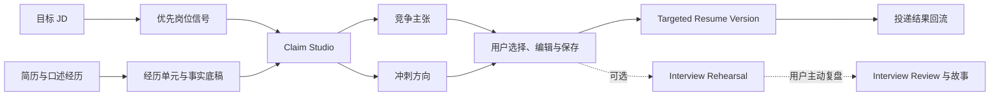

# AI Job Copilot Product Definition

Status: Proposed v0.2 for owner review
Date: 2026-08-09

Research basis: [Competitive Capability Matrix](./COMPETITIVE_CAPABILITY_MATRIX.md)

## Decision summary

AI Job Copilot 是一个面向**具体中文 AI 岗位投递**的经历挖掘与表达增益工作台。它不审计用户有没有做过某件事，也不通过连续追问采访用户，而是接受用户陈述作为工作底稿，直接指出职责、难度、规模、决策与结果中最值得拓展的方向，再写成招聘方能迅速识别的价值。

本版相对 v0.1 作出五项方向调整：

1. 外部证据、材料核验和“能力缺口证明”退出主流程。
2. 产品目标由“判断是否覆盖 JD”改为“把已有经历表达得更强、更相关、更具体”。
3. 用户自己陈述的事实默认被接受；系统不要求上传仓库、工作文档或结果证明。
4. 系统允许积极重构与合理推断，但不悄悄补造新的职责、技术、数字或业务结果。遇到这类信息时直接给出补全方向或留下可编辑标记，不要求用户回答问题才能继续。
5. 评测重点从抽取准确率和覆盖分，转向经历挖掘效率、表达增益、用户采纳、面试可讲述性和真实投递结果。

这里的产品立场不是“越保守越真实”，而是：

> 在候选人能够自然讲清楚的边界内，把一段经历包装到尽可能强。

## Product boundary

一次产品任务称为 **Target Application（目标投递）**：

- 开始：用户已经拥有一份具体 JD；只有岗位名称或通用岗位资料不能启动 P0 Claim Studio。
- 输入：具体 JD、现有简历，或用户从 owner-scoped Experience Library 中明确选择的当前项目/实习/工作经历。
- 结束：形成一份 Targeted Resume Version，即本次投递下保存的定向主张集合，包含可直接使用的简历主张、来源关联和可复用的面试状态；P0 不承诺完整简历排版或 PDF 编辑。

产品不负责：

- 要求用户提交外部材料证明经历；
- 替招聘方核验候选人或做背景调查；
- 根据简历预测适合什么职业；
- 设计长期学习或转型路径；
- 预测面试或录用概率；
- 自动提交职位申请。

方向探索、角色尝试和长期能力建设属于寻径星图，不进入这个仓库。

## User and job to be done

### 首发验证人群

首版只围绕正在申请中文 AI 产品经理岗位、已有真实工作或项目经历，但不会把经历讲强的求职者进行产品优化和效果验证。其原始简历通常停留在“负责什么”，没有主动呈现为什么难、自己做了什么判断、影响了谁、结果有多大，也不知道怎样把内部语言翻译成目标岗位认可的能力信号。

系统技术上可以接受其他 AI 岗位，但首版的产品承诺、岗位语义、补全推荐策略、评测案例和前 10 名用户都以 AI 产品经理为边界。在取得单一人群的有效信号前，不对算法、AI 应用工程或数据岗位宣称同等效果。

这仍是待验证的用户假设，不是已经证明的市场结论或完整目标市场。

### Job to be done

> 当我准备申请一个具体 AI 岗位时，帮我从平淡、零散的经历里挖出值得卖的部分，先形成可用的竞争主张，再直接告诉我可以补什么、怎样把它推进为面试时仍讲得下去的冲刺方向，由我自己决定是否补充。

## Product thesis

AI 简历润色、JD 匹配、成就量化和对话挖掘都已经有竞品。AI Job Copilot 不能靠“会润色”或“会追问”获得差异化。

当前值得验证的产品假设是：

> 求职者缺的不是一句更漂亮的文案，而是一套能先交付当前可用主张、再给出独立增强方向，并让用户把选中主张继续展开成面试故事的工作流。

产品优化目标可以写成：

`表达收益 = 岗位相关性 × 具体度 × 影响力 × 可讲述性 − 无意新增事实的风险`

这不是科学评分公式，而是产品取舍：包装不能只追求辞藻强度，也要让用户在招聘方连续追问时仍能展开细节。

## Core product model

产品围绕 **Competitive Claim（竞争主张）＋ Stretch Direction（冲刺方向）** 这组分离交付物工作：

### 两种分离交付物

| 交付物 | 作用 | 允许的增益 | 不做的事 |
| --- | --- | --- | --- |
| 竞争主张 | 默认工作区中的可用简历内容 | 基于当前事实强化责任、难度、范围与业务价值 | 把参与写成独立负责；把相关性写成因果；把待补细节写成既成事实 |
| 冲刺方向 | 帮助用户自行思考怎样继续增强 | 每条竞争主张只指出一个最高价值的补全维度，说明它对目标岗位的价值，并展示更强表达的大致形态 | 给出多个方向组成通用检查表；把建议写成第二条成品主张；静默生成新的技术、规模、指标或成果 |

竞争主张和冲刺方向不是“正式、技术、轻松”这类语气选择，也不是两个并列的改写答案。竞争主张是当前事实可以支持的成品；冲刺方向只是可选建议，由用户自行决定是否把它转化为新的事实或编辑。

### 为什么仍保留轻量边界

产品不要求证明，但要防止模型在改写时擅自把“参与”变成“主导”、把“效果不错”变成虚构百分比。原因不是道德审计，而是产品效果：这类主张最容易在面试追问中断裂，也让用户无法判断 AI 到底改了语言还是改了人生经历。

因此每个新事实只需要用户做轻量选择：补充、修改、跳过。无需上传证明，也不阻止用户以自己的判断接受最终版本。

## Product workflow and output

1. 创建 Target Application，粘贴或导入必填的具体 JD，并上传简历或从 Experience Library 中选择要复用的 Experience Entry 或 Experience Item；岗位名称或通用岗位资料只能作为浏览上下文。首次上传解析出的经历与 Base Facts 只作为当前投递的临时资料使用，不自动写入 Experience Library。
2. 系统只挑出最值得影响本次投递的最多 3 个主要 Role Signals；显性信号关联 JD 原文，推断信号明确标记为系统解释并说明理由。相关信号不足时少给，不生成大而全的缺口报告或为了凑数补充弱信号。
3. 系统把实习或正式工作识别为 Experience Entry，并在其中拆出具体项目、职责模块或成果故事作为 Experience Items；独立项目直接成为 Experience Item。主张只从 Item 及其 Base Facts 生成，Entry 只提供组织、职位和时间等共享上下文。个人总结、技能清单和教育经历只作为上下文。当前投递的临时资料可立即参与主张生成，只有用户显式选择“保存到经历库”后才成为跨投递复用内容。
4. 系统按预期价值直接推荐责任、难点、决策、规模、前后变化与结果中值得拓展的方向，不要求用户逐题回答。
5. 形成可复用的 Base Facts，用户无需提交外部证明。
6. 按对目标 JD 的预期影响选择最多 3 个主张机会，每个生成一条竞争主张和一个高价值冲刺方向；同一 Experience Item 可以贡献多条，但来源片段、主要 Role Signal 或价值重点必须不同，不能语义重复。相关内容不足时少给，不为了凑数生成弱内容。
7. 用户选择、混合或编辑并明确保存；系统只从保存前后的文字差异更新 owner-scoped Writing Preference Profile。若编辑内容或后续面试回答可能构成新的 Base Fact，系统只生成 Fact Update Proposal，必须由用户明确操作后才写入 Experience Library。来源资料在主张生成后发生变化时，系统保留原主张并展示 Source Change Notice，只有用户显式重新分析才基于最新资料调用模型。
8. 用户可以从选中的主张进入独立的 Interview Rehearsal；系统根据该主张、目标岗位和已有回答逐轮追问，并自行判断是否还有值得继续的问题，不设置固定轮数或专门的结束操作。用户不再回答即自然停止。
9. Interview Review 与追问结束分离，只有用户主动触发时才输出已经讲清楚的部分、仍可能被追问的断点、基于实际回答整理的 60 秒 Interview Story 和一个最高价值改进建议；不提供总分、面试概率或录用概率。
10. 输出可复制或导出为文本/Markdown 的 Targeted Resume Version 主张集合，并记录投递、筛选、面试与结果，供后续版本比较；完整模板和 PDF 编辑器不进入 P0。

首版核心界面应围绕“原始经历—竞争主张—冲刺方向—用户编辑—面试故事”展开，不再围绕“要求—证据—覆盖分”展开。

每条结果必须保留四个可检查的信息对象：原始 Experience Item 片段、一个主要 Role Signal、Competitive Claim 和一个 Stretch Direction。它们用于说明系统为什么选择这段经历、改写发生在哪里，不构成外部事实核验。

“当前不足”只表示 Expression Gap：现有 Experience Item 或 Competitive Claim 没有把主要 Role Signal 所关心的责任、判断、难度、规模或结果讲清楚。它由 Stretch Direction 直接说明，不推断候选人缺少这项能力，也不另行生成能力缺口报告。

## Differentiation

### 已被竞品占据的能力

- AI 简历润色和 bullet 生成；
- ATS 或关键词匹配；
- JD 定向改写；
- 用 STAR、行动动词和量化结果重构经历；
- 对话式经历挖掘；
- 逐条接受或编辑 AI 建议；
- 单独的模拟面试或面试题预测。

### 值得验证的组合差异

1. **成品与方向分层，而不是一次改写。** 先交付当前可用的竞争主张，再用独立的冲刺方向说明还能补什么、为什么值得补；不把建议伪装成另一条成品。
2. **为中文 AI 岗位做语义翻译。** 重点理解 AI 产品、Agent、RAG、评测、模型迭代、数据闭环和跨职能协作中的真实角色信号，而不是只替换通用动词。
3. **补全方向，而不是 AI 访谈。** 不把用户拖进长对话；系统直接推荐最值得拓展的维度，用户可以思考、编辑、忽略或继续使用当前竞争主张。
4. **简历主张直接连接面试故事。** 不是另开一个通用模拟面试，而是让用户立即检验刚选中的强表述能否被自然展开。
5. **跨投递复用与稳定历史。** owner-scoped Experience Library 让同一 Experience Item 与 Base Facts 服务不同 JD；每个 Target Application 保留生成时使用的 Source Snapshot，后续资料库更新不追溯改写历史结果。

这是一组可检验的产品组合，不是不可复制的商业壁垒。若要形成壁垒，需要长期积累“什么经历、怎样表达、投向什么岗位、获得什么结果”的脱敏反馈数据。

### 个人开源项目仍可展示的特点

- 面向中文 AI 岗位；
- 自托管与用户自带模型；
- 公开提示词版本、失败案例和生成评测；
- 不用虚假的录用概率或总分制造权威感。

这些特点提升可信度和展示辨识度，但不单独构成市场优势。

## Evaluation and decision gates

### 节点 A：补全方向是否真的帮助用户想到更多可用信息

对同一批脱敏经历分别使用固定检查表、通用模型建议和 AI Job Copilot 的优先级补全方向。人工仅判断用户自愿补充的新信息是否能实际改善目标岗位的简历主张，不要求外部证明。

核心指标：

- 每个案例因补全方向新增的可用 Base Facts 数；
- 从开始到第一条可采纳主张的时间；
- 用户采用、编辑或忽略补全方向的比例；
- 从看到推荐到完成自主补充的时间；
- 责任、难度、规模、决策和结果五类信息的恢复率。

阶段门槛将在评测 rubric、样本构成、人工标注规则和基线分布确定后单独批准；本节点先报告相对固定检查表的新增 Base Facts、完成时长和失败案例，不预设百分比。

### 节点 B：两阶段增益是否比通用 AI 更强

每个案例产生原简历、同一模型的一次性通用改写和 AI Job Copilot 竞争主张。对照组与实验组使用相同模型、生成参数、简历和 JD，只改变提示词与工作流；由不了解方案来源的评审者做成对选择，并记录选择原因。冲刺方向的效果在节点 A 通过用户是否产生有效自主编辑单独评估。

核心指标：

- 岗位相关性、具体度、影响力、自然度与资历信号；
- 相对原文和通用 AI 基线的盲选偏好率；
- Saved Claim Rate、保存前语义修改幅度，以及复制或导出行为；
- 用户认为“太保守”或“夸过头”的比例；
- 模型静默新增职责、技术、数字或结果的比例。

阶段门槛将在成对评测 rubric、盲评样本量和人工基线确定后单独批准；当前只要求同时报告盲选偏好和静默新增重要事实，不能用单一偏好率掩盖事实边界退化。

强模型可以按版本化 rubric 做匿名、随机顺序的成对比较，用于高频提示词回归，但它只是代理评审，不能单独决定阶段性接受。阶段决策由真实候选人与具备相关招聘或用人经验的评审者盲选；代理评审必须与人工结果校准并披露分歧。Rubric 的具体维度、锚点和失败条件在实现前单独决定。

### 节点 C：表达强度是否真的给用户控制感

比较只有一条最佳答案与“竞争主张＋冲刺方向”的分层交付。观察方向推荐是否帮助用户产生有效自主编辑，以及是否减少反复要求“再强一点”或“别写得这么夸张”。

核心指标：

- 首次选择耗时；
- 用户直接采用竞争主张、根据冲刺方向自主编辑或忽略方向的分布；
- 重新生成次数；
- 用户手工回退责任或因果表述的次数；
- 同一用户跨多个岗位的稳定偏好。

若冲刺方向只增加认知负担、没有带来更多有效信息或降低返工，则退回单一竞争主张。

### 节点 D：简历到面试的桥接是否有效

让用户从选中的 Resume Claim 进入 Interview Rehearsal，由 AI 根据信息价值决定是否继续追问；用户可以停止回答，并可选择是否主动生成 Interview Review。评审只检查其是否能说清背景、个人作用、关键判断、结果和限制，不要求外部材料。

核心指标：

- 60 秒故事完成率；
- AI 继续追问或停止的判断是否恰当；
- 已回答内容保持前后一致的比例；
- 用户主动生成 Interview Review 的比例；
- 从演练中补回简历的有效细节数；
- 用户对“我敢不敢在面试中用这句话”的评分变化。

### 节点 E：真实投递是否改善

在用户授权下记录岗位、简历版本、是否过筛、是否面试和最终结果。优先比较同一用户、相近岗位、相近时间窗口内的版本差异，避免把公司、资历和市场差异错误归因于文案。

业务指标：

- Saved Claim Rate：成功生成至少一条竞争主张的分析中，用户把至少一条明确保存进 Targeted Resume Version 的比例；它只表示可观测采用行为，不表示主张已被证明有效；
- 首条可采纳 bullet 的时间；
- 完成并导出率；
- 第二个 JD 的事实底稿复用率；
- 投递到面试转化率；
- 用户次周继续使用率。

投递转化只能作为滞后结果，不能在样本很小时宣称因果。

## Initial validation plan

首轮直接在现有全栈产品中实现一个薄的真实产品切片，用它验证核心动作：

1. 收集 30 组经授权脱敏的“原简历＋目标 JD＋用户自主补充或编辑”。
2. 每组生成原文、通用 AI 基线和竞争主张，并单独生成冲刺方向供案例提供者自主编辑。
3. 至少邀请 3 名有相关招聘或用人经验的评审者做盲选；若暂时只能用强模型评审，必须标为代理评测，不能冒充招聘者结论。
4. 复用现有 JD/岗位/简历输入、文件解析、鉴权、历史与导出能力，把匹配分主导的结果层改为“竞争主张＋冲刺方向＋用户编辑＋面试故事”。
5. 同步优化这一薄切片的 UI；具体信息架构、交互和视觉方案在实现前单独决策。
6. 邀请 10 名真实用户查看冲刺方向、自主编辑、选择主张并进入由 AI 控制追问节奏的 Interview Rehearsal，记录回答、自然停止、主动复盘和修改原因。
7. 只在表达增益、补全建议有效性和讲述性都过门槛后，再扩展完整简历编辑器与投递反馈闭环。

首批 10 人只用于建立 Saved Claim Rate、修改幅度和行为路径的描述性基线，不预设任意的绝对保存率门槛。后续提示词或 UI 版本与该基线比较，同时监控盲评质量和静默新增重要事实，避免为了提高保存行为牺牲内容边界。

首批基线中的首次使用统一采用空白 Writing Preference Profile；个性化效果在同一用户的后续 Target Applications 中单独观察。每次生成记录所用偏好快照，避免把个性化漂移误判成系统提示词提升。

## Risks and open questions

### 已知风险

- “经历挖掘＋量化＋JD 定向”已经有直接竞品，不能依赖功能清单获得市场优势。
- 冲刺方向可能被误解为系统暗示用户编造经历，界面必须把它与可复制的简历主张明确分开。
- 用户会记错、估算或主动夸大；产品既不可能验证，也不应把用户陈述冒充外部事实。
- 补全方向可能过于通用或一次给得太多，用户看完仍不知道该怎样修改。
- 仅靠强模型评审容易奖励华丽文字，需要真实招聘评审和用户面试展开共同校准。
- 投递结果受公司、岗位、时机和候选人背景强烈影响，需要避免小样本营销结论。
- 当前没有证明中文 AI 岗位细分足以支撑独立商业产品。

### 需要产品所有者继续决定

1. 薄切片的 UI 信息架构、交互方式和视觉方向是什么？
2. Competitive Claim、Stretch Direction 和 Interview Rehearsal 的评测 rubric 如何定义？

### 已确认的产品所有者决策

1. Initial Validation Cohort 只包括正在申请中文 AI 产品经理岗位的求职者；其他岗位可以输入，但不进入首版承诺、优化与效果评测范围。
2. Claim Studio 只交付两种明确分离的对象：竞争主张是默认可用成品；冲刺方向是帮助用户自行思考的拓展建议，不是第二条成品主张，也不作为简历内容直接导出。
3. 首轮直接改造现有全栈产品中的结果层，复用输入、文件解析、鉴权、历史和导出；不先做人工 concierge，也不重写整个系统。UI 优化包含在薄切片范围内，但具体方案延后单独讨论。
4. 每条竞争主张只附一个冲刺方向，由系统选择对当前 Target Application 预期价值最高的补全维度；不向用户展示通用方向清单。
5. 每次分析最多生成 3 条竞争主张，按对当前 Target Application 的预期影响排序；源材料不足时返回更少，不用低价值内容补足数量。
6. P0 只从独立项目 Experience Items，以及实习/正式工作 Experience Entries 内的项目、职责模块或成果 Experience Items 生成主张；个人总结、技能清单和教育经历可以提供上下文，但不单独生成主张。
7. 每条竞争主张必须关联原始 Experience Item 片段和一个主要 Role Signal，并与其唯一冲刺方向共同交付；该关联用于解释改写，不用于证明经历真假。
8. 用户编辑后的文字立即成为其选定的 Resume Claim；编辑过程不自动调用模型、不覆盖用户文字，也不自动刷新冲刺方向。再次分析必须由用户显式触发。
9. 主张生成场景不追问用户；Interview Rehearsal 是独立且可选的多轮状态，系统从用户选定的 Resume Claim、目标岗位和已有回答继续自适应追问。
10. Interview Rehearsal 不设固定轮数或结束按钮，由 AI 判断是否继续提问；用户不再回答即自然停止。Interview Review 只在用户主动触发时生成，不随追问结束自动出现。
11. AI 只在下一问预计能显著改善故事的背景、个人角色、关键行动或判断、结果或限制、Role Signal 相关性或前后一致性时继续追问；否则停止，不为凑轮数制造问题。
12. Interview Review 只提供基于用户实际回答的结构化文字复盘：已讲清楚的部分、仍可能被追问的断点、60 秒 Interview Story 和一个最高价值改进建议；不提供数字总分或面试/录用概率。
13. P0 的简历、JD、主张、编辑、面试回答和行为指标默认只保存在 owner-scoped 账户或自托管实例中，不自动上传任何内容或所谓脱敏遥测。共享评测样本必须逐案例授权、由用户主动导出并经人工脱敏。
14. P0 的产品主埋点是 Saved Claim Rate：成功返回至少一条竞争主张的分析中，用户明确保存至少一条到 Targeted Resume Version 的比例。该指标衡量可观测采用行为，不被描述为主张有效性。
15. 首批 10 人只建立 Saved Claim Rate 的描述性基线，不设置绝对成功阈值；后续版本以相对变化为主，并同时检查修改幅度、盲评质量和静默新增重要事实。
16. Competitive Claim 的受控 AI 基线使用同一模型、相同生成参数和相同简历/JD，只给予一次性通用改写提示词；实验组只改变 AI Job Copilot 的提示词和工作流，原始简历作为非 AI 参考。
17. 强模型按照版本化 rubric 和匿名随机顺序做高频成对代理评测；阶段性接受由真实候选人与相关招聘/用人评审盲选决定。Rubric 的具体设计延后单独讨论。
18. P0 不采用 Agent 作为核心编排器。Application Studio 以确定性工作流控制状态，并分别版本化 `Target Analysis`、`Claim Studio`、`Interview Rehearsal` 和 `Interview Review` 四个提示词族；现有通用 Agent Loop 留在核心流程之外。参见 ADR-0001。
19. `Target Analysis` 每次最多提取 3 个主要 Role Signals，并与最多 3 条竞争主张的选择范围保持一致；信号不足时返回更少，不为满足数量配额生成弱信号。
20. 每个 Role Signal 必须声明来源：显性信号关联 JD 原文；推断信号明确标记为系统解释并给出一句理由。两者都不被描述为招聘者真实意图。
21. 最多 3 条竞争主张不设置 Experience Item 多样性配额；同一经历可以贡献多条，但每条必须具有不同的来源片段、主要 Role Signal 或价值重点，禁止语义重复。
22. Competitive Claim 可以压缩、重组、翻译为岗位语言，并在 Base Facts 已直接支持时使用更强动词；不能把参与升级为主导、相关性升级为因果，也不能新增技术、数字、规模或结果等重要事实类别。
23. P0 的 Targeted Resume Version 是一次 Target Application 下保存的定向主张集合及其来源、Role Signal 和面试状态，不是完整简历模板或 PDF 编辑器；首轮只支持复制或文本/Markdown 导出。
24. 新 Target Application 不再生成匹配分、覆盖总分、面试概率或录用概率。旧的分数型分析记录可以在迁移期间只读保留，但不进入新工作流状态。
25. “当前不足”只作为 Stretch Direction 内的 Expression Gap 出现，用来描述现有措辞没有为主要 Role Signal 讲清什么；它不是 Capability Gap，不单独形成缺口报告，也不推断用户缺少某项能力。
26. P0 的 Target Application 必须提供具体 JD 文本；岗位名称或通用岗位资料可以用于浏览，但不能单独启动 Target Analysis 或 Claim Studio。
27. P0 建立 owner-scoped Writing Preference Profile，只从用户明确保存前后的主张差异学习句长、信息密度、技术细节和结果位置等风格；用户可查看、修改、关闭或清空，且每次生成记录偏好快照。偏好不能改变事实边界。
28. P0 建立 owner-scoped Experience Library 复用当前保存的 Experience Items 与 Base Facts。每个 Target Application 保留生成时使用的 Source Snapshot；主张编辑或面试回答只能生成 Fact Update Proposal，只有用户显式操作才写入资料库，后续资料库修改不追溯改写历史投递。参见 ADR-0003。
29. 首次上传简历后，解析出的 Experience Items 与 Base Facts 只作为当前 Target Application 的临时资料，可立即用于生成主张，但不会自动写入 Experience Library。P0 不向用户暴露事实审批、内容哈希或 `Draft/Saved/Superseded` 版本状态机。
30. P0 使用两层经历结构：Experience Entry 表示一段实习或正式工作并保存公共背景；Experience Item 表示其中一个具体项目、职责模块或成果故事，是生成主张的最小单位。独立项目直接作为 Experience Item。导入可以建议拆分边界，但用户可纠正；P0 不扩展为完整项目 dossier 或证据档案系统。参见 ADR-0004。
31. Experience Item 或 Base Fact 在主张生成后发生变化时，P0 保留已有生成结果和用户编辑，展示非阻断的 Source Change Notice，不自动重写、删除、失效或静默切换其 Source Snapshot。只有用户显式触发重新分析，系统才使用最新来源发起新模型运行。参见 ADR-0005。
