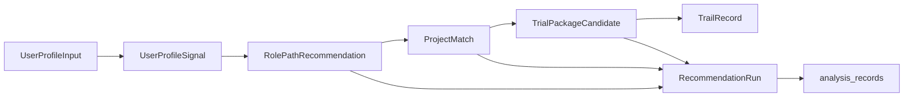

# 寻径星图 P1-B 技术架构方案

任务 ID：P1B-TECH-001
接管说明：原“技术方案A”子进程未能在指定 worktree 生成目标文件，本文由主 Agent 接管完成。
日期：2026-06-09

## 1. 总体技术结论

P1-B 可以开始实现“真实用户背景 -> 受控路径推荐 -> 审核开源项目匹配 -> 生成试航包”的真实产品功能，但第一轮必须是规则优先、证据链优先、人工审核项目库优先的可解释系统，而不是黑箱推荐系统。

技术路线建议拆成两个阶段：

- P1-B.1：继续使用 JSON fixture 作为路径、项目、规则和试航模板的数据源；继续复用 `analysis_records` 保存用户推荐运行结果、试航包快照和 TrailRecord；新增受控推荐 API、项目库 API 和试航包生成 API。
- P1-B.2：当出现多路径运营、项目上下线、版本审计、历史检索和规则维护后台需求后，再单独做 Pathfinder 专用表与 Alembic migration PRD。

P1-B.1 不接入 LLM 主链路。LLM 后续只能用于背景摘要、文案润色、反包装辅助提示或人工标注辅助，不能单独决定路径、项目或结论。

## 2. P1-B 与 P1-A / P2 边界

P1-A 已完成：

- 真实用户输入背景。
- 固定 `p1a-opendocuments-engineering-kb` TrialPackage。
- 固定 OpenDocuments 参考项目。
- 6 问试航、保存、反包装阻断和 Markdown 导出。
- 继续复用 `analysis_records`，无 migration。

P1-B.1 新增：

- 从真实用户输入抽取结构化信号。
- 基于规则推荐 3 到 4 条受控 RolePath。
- 从人工审核 `OpenSourceProjectRecord` 库选择候选项目。
- 基于路径、项目、用户背景生成 `TrialPackageCandidate`。
- 将推荐运行和试航包选择写入 `analysis_records` 输入 / 结果快照。

P1-B.1 仍不做：

- 能力认证、岗位胜任证明、offer 概率预测。
- 企业筛选、企业推荐、精准内推。
- 简历包装、自动投递、简历真实性判断。
- 实时 GitHub 搜索、真实 RAG、黑箱多项目推荐。
- 对外展示分数、百分比、排名或复杂评分。

P2 才考虑：

- 多 TrialPackage 发布流。
- 内容审核后台和项目上下线工作台。
- 规则配置后台。
- 专用表、迁移、审计日志和数据报表。
- 与岗位推荐系统或高校 / 企业场景联动。

## 3. 数据流



处理步骤：

1. `UserProfileInput`：前端提交用户真实背景、目标、限制条件、经历和工具经验。
2. `UserProfileSignal`：后端用规则抽取行业、经验、工具、交付物、风险和约束信号。
3. `RolePathRecommendation`：推荐服务基于规则命中输出“优先试航 / 可探索 / 暂缓主攻”等试航语义。
4. `ProjectMatch`：项目服务只从人工审核项目库中选择可追溯参考项目。
5. `TrialPackageCandidate`：试航包服务组合路径、项目、任务模板、6 问和反包装规则。
6. `TrailRecord`：用户完成试航后继续沿用现有 P1-A 记录保存、反包装检查和 Markdown 导出机制。

## 4. 推荐引擎设计

推荐引擎使用规则优先策略。内部可以有权重和排序，但 UI、Markdown 和 API 响应不得展示分数、百分比、胜任度或录用概率。

推荐依据分为四类：

- 用户背景证据：专业、行业经历、项目经历、文档 / 调研 / 沟通 / 数据处理 / AI 工具使用。
- JD 样本证据：当前样本趋势中的常见任务、交付物、风险边界。
- 项目证据：人工审核开源项目的公开能力、适配场景、可拆解任务。
- 风险证据：缺少工程交付、缺少代码证据、缺少客户沟通、过度归属表述等。

推荐结论只能使用这些状态：

```ts
type RecommendationDecision =
  | 'priority_trial'
  | 'explore'
  | 'not_recommended_short_term'
  | 'insufficient_information'
```

规则例子：

- 行业资料理解、文档整理、调研、PRD、流程梳理命中时，优先推荐“行业 AI 应用产品助理”。
- 客户沟通、方案材料、PoC、交付协同命中时，推荐“行业 AI 解决方案助理”为可探索。
- 标注、质检、测试、表格分析、错误归因命中时，推荐“AI 数据评测助理”为可探索或优先试航。
- 缺少代码、模型实验、算法复现和工程证据时，算法 / 大模型研发只能短期暂缓主攻。

## 5. 项目匹配设计

项目匹配只从人工审核 `OpenSourceProjectRecord` 库中选择，不做实时 GitHub 搜索，不根据 stars / forks / commits 评分。

匹配依据：

- `rolePathIds`
- `projectTags`
- `capabilityTags`
- `riskTags`
- `publicCapabilities`
- `allowedContexts`
- `forbiddenClaims`
- `licenseVerificationStatus`
- `status`

项目必须满足：

- `status = approved_for_trial_package`
- `referenceRole = reference_only`
- `licenseVerificationStatus = verified`
- 存在 `licenseFileUrl` 和 `lastManualCheckAt`
- 反包装字段完整

P1-B.1 可展示“推荐参考项目”，但表达必须是：

- “可作为试航参考”
- “用于理解该场景的公开能力”
- “用于生成试航任务起点”

不得表达为：

- “最适合你”
- “证明你胜任”
- “你参与了该项目”
- “该项目提升 offer 概率”

## 6. API 设计草案

### POST /api/pathfinder/recommendations

用途：根据真实用户背景生成受控路径推荐和项目候选摘要。

```ts
type PathfinderRecommendationRequest = {
  userProfile: UserProfileInput
  preferredRolePathIds?: string[]
  constraints?: CareerConstraint[]
  ruleVersion?: string
}

type PathfinderRecommendationResponse = {
  schemaVersion: 'p1b.v1'
  recommendationRun: RecommendationRun
  profileSignals: UserProfileSignal[]
  paths: RolePathRecommendation[]
  projectMatches: ProjectMatch[]
  scopeDisclaimer: string
}
```

### GET /api/pathfinder/projects

用途：读取人工审核项目库，可按路径、标签和状态过滤。

```ts
type PathfinderProjectsQuery = {
  rolePathId?: string
  capabilityTag?: string
  status?: 'approved_for_trial_package' | 'candidate' | 'needs_review'
}

type PathfinderProjectsResponse = {
  schemaVersion: 'p1b.v1'
  projects: OpenSourceProjectRecord[]
  dataBoundary: string
}
```

### POST /api/pathfinder/trial-packages/generate

用途：基于用户选择的路径和项目生成试航包候选。

```ts
type GenerateTrialPackageRequest = {
  recommendationRunId: string
  userProfileSnapshot: UserProfileInput
  selectedPathId: string
  selectedProjectId: string
}

type GenerateTrialPackageResponse = {
  schemaVersion: 'p1b.v1'
  trialPackageCandidate: TrialPackageCandidate
  antiPackagingDefaults: AntiPackagingCheck
}
```

### POST /api/pathfinder/records 兼容策略

现有 `/records` 继续用于创建和保存 TrailRecord。P1-B.1 只扩展 `input_text` 和 `result` JSON envelope，不改变表结构。

```ts
type PathfinderRecordInputEnvelope = {
  schemaVersion: 'p1b.v1' | 'p1a.v1'
  recommendationRunId?: string
  trialPackageId: string
  trialPackageVersion: string
  selectedPathId: string
  selectedProjectId?: string
  userProfileSnapshot: UserProfileInput
  trialPackageSnapshot: TrialPackageCandidate | TrialPackage
}
```

## 7. Schema 草案

```ts
type UserProfileSignal = {
  signalId: string
  category:
    | 'industry_background'
    | 'domain_material'
    | 'communication'
    | 'data_handling'
    | 'ai_tool_usage'
    | 'technical_foundation'
    | 'career_constraint'
    | 'risk'
  label: string
  sourceField: keyof UserProfileInput | string
  evidenceText: string
  confidence: 'rule_high' | 'rule_medium' | 'needs_user_clarification'
}

type RecommendationEvidence = {
  evidenceId: string
  type: 'jd_sample' | 'user_profile' | 'open_source_project' | 'risk' | 'next_trial'
  title: string
  detail: string
  sourceRef: string
}

type RolePathRecommendation = {
  pathId: string
  title: string
  decision: RecommendationDecision
  rationale: string
  evidence: RecommendationEvidence[]
  riskNotes: string[]
  suggestedProjectTypes: string[]
  nextTrialAction: string
}

type OpenSourceProjectRecord = {
  projectId: string
  name: string
  sourceUrl: string
  host: 'github' | 'gitlab' | 'other_public_source'
  description: string
  license: string
  licenseSpdxId?: string
  licenseFileUrl?: string
  licenseVerificationStatus: 'verified' | 'pending' | 'failed'
  lastManualCheckAt?: string
  referenceRole: 'reference_only'
  status: 'candidate' | 'approved_for_trial_package' | 'needs_review' | 'retired'
  rolePathIds: string[]
  projectTags: string[]
  capabilityTags: string[]
  riskTags: string[]
  publicCapabilities: string[]
  notClaimed: string[]
  forbiddenClaims: string[]
  allowedContexts: string[]
}

type ProjectMatch = {
  projectId: string
  rolePathId: string
  decision: 'matched_for_trial' | 'candidate_needs_review' | 'not_matched'
  matchedRules: string[]
  evidence: RecommendationEvidence[]
  boundaryNotes: string[]
}

type TrialPackageCandidate = {
  trialPackageId: string
  trialPackageVersion: string
  generatedFrom: {
    recommendationRunId: string
    selectedPathId: string
    selectedProjectId: string
    ruleVersion: string
  }
  title: string
  targetRolePath: RolePathRecommendation
  sourceProject: OpenSourceProjectRecord
  trialQuestions: Array<{ questionId: string; title: string; prompt: string; required: boolean }>
  requiredMarkdownSections: string[]
  forbiddenClaims: string[]
  sampleJdDisclaimer: string
}

type RecommendationRun = {
  recommendationRunId: string
  schemaVersion: 'p1b.v1'
  createdAt: string
  ruleVersion: PathfinderRuleVersion
  userProfileSnapshot: UserProfileInput
  profileSignals: UserProfileSignal[]
  paths: RolePathRecommendation[]
  projectMatches: ProjectMatch[]
  selectedPathId?: string
  selectedProjectId?: string
}

type PathfinderRuleVersion = {
  version: string
  effectiveAt: string
  rolePathTaxonomyVersion: string
  projectLibraryVersion: string
  antiPackagingRuleVersion: string
  notes: string[]
}
```

## 8. 后端服务拆分建议

- `pathfinder_profile_service`：负责用户输入归一化、字段校验、信号抽取。
- `pathfinder_recommendation_service`：负责路径规则命中、证据链组装、推荐结果排序。
- `pathfinder_project_service`：负责读取项目 fixture、筛选审核状态、返回项目证据和边界。
- `pathfinder_trial_package_service`：负责组合路径、项目、任务模板和 Markdown 必需章节。
- `anti_packaging_service`：负责运行反包装规则、返回阻断 / 提醒 / 通过状态。

P1-B.1 可以先使用纯函数和 JSON fixture，避免引入复杂依赖。后端 router 只做请求校验、用户隔离和响应封装。

## 9. 存储路线

P1-B.1：

- 路径 taxonomy、项目库、匹配规则、任务模板：使用 `data/pathfinder/**` JSON fixture。
- 推荐运行结果：保存到 `analysis_records.result` 的 `recommendationRun`。
- 用户输入和试航包快照：保存到 `analysis_records.input_text`。
- TrailRecord、TrialAnswer、AntiPackagingCheck、MarkdownSnapshot：继续沿用当前 result envelope。
- 不新增表，不新增 Alembic migration。

P1-B.2：

- 单独做专用表 PRD，评估 `pathfinder_recommendation_runs`、`pathfinder_projects`、`pathfinder_trial_packages`、`pathfinder_records`。
- 只有当历史检索、项目上下线、审核队列、版本审计成为真实需求时才 migration。

## 10. LLM 边界

P1-B 第一轮不让 LLM 决定路径或项目。

允许的后续增强：

- 将用户长文本背景摘要为结构化候选信号，但必须显示“待用户确认”。
- 辅助生成作品集文案草稿，但必须受反包装规则检查。
- 辅助数据维护者摘要 README，但不能替代 License / README 人工核验。
- 辅助解释为什么某条路径需要补充信息。

禁止：

- LLM 直接输出最终路径推荐。
- LLM 直接选择开源项目。
- LLM 输出能力认证、录用概率、胜任分数。
- LLM 生成“用户参与开源项目”的暗示。

## 11. Scope Guard 与安全边界

接口、UI 和导出文本必须拦截以下表达：

- 认证、胜任、通过、录用、概率、offer、企业筛选、企业推荐。
- “我开发了该开源项目”“我参与了官方贡献”“我实现了企业级系统”。
- “可直接上线生产环境”“替代专业审核”“保证准确”。
- “市场全量岗位”“完整覆盖”。

所有样例 JD 必须附带：“样例 JD / 当前样本趋势参考，不代表具体公司岗位要求或录用判断。”

## 12. 前端、后端、数据、QA 拆分建议

前端：

- 背景页增加“生成试航路径”动作。
- 推荐页展示真实用户信号、路径推荐和项目候选。
- 试航页支持不同 TrialPackageCandidate，但仍沿用 6 问结构。
- 结果页展示推荐运行追溯链。

后端：

- 新增 recommendation / projects / generate 三组 API。
- 实现 profile signal extraction、rule matching、project matching。
- 保持 `/records` 兼容。

数据：

- 将 OpenDocuments 从 P1-A fixture 升级为项目库第一条 approved 记录。
- 补 3 到 5 个候选项目类型，未核验则不能进入 approved。
- 补路径 taxonomy、项目标签、任务模板和反包装规则版本。

QA：

- 增加无小 C 默认内容回归。
- 增加无评分 / 无概率 / 无认证静态检查。
- 增加项目 License 待核验不能生成 full trial package 的用例。
- 增加 recommendation API 与 records API 兼容测试。

## 13. 最小实现里程碑和验收标准

里程碑 1：数据 fixture

- 至少 4 条 RolePath。
- 至少 1 条 approved 项目 OpenDocuments。
- 至少 3 条待核验候选项目类型。
- 项目库均包含 License / 待核验状态、notClaimed、forbiddenClaims。

里程碑 2：后端规则 API

- `POST /recommendations` 可根据用户输入返回路径建议。
- `GET /projects` 可过滤 approved 项目。
- `POST /trial-packages/generate` 可生成 OpenDocuments 试航包。
- 不新增 migration。

里程碑 3：前端产品流

- 用户填写背景后进入推荐页。
- 推荐页不是固定小 C 结果，而是展示用户信号和规则命中证据。
- 用户选择路径 / 项目后生成试航包并完成原 P1-A 保存导出链路。

里程碑 4：QA

- 后端 pytest 覆盖推荐、项目、生成、records 兼容。
- 前端 E2E 覆盖真实用户输入到导出。
- 静态安全检查无禁用表达。

## 14. 不进入 P1-B 的内容

- LLM 主链路推荐。
- 真实 RAG 检索。
- 实时 GitHub 搜索或自动抓取。
- 项目热度排名。
- 能力认证、offer 概率、企业筛选。
- 自动简历生成或包装。
- 专用表和 migration 的直接实现。
- 多项目黑箱推荐。
- 高校端、企业端、岗位投递联动。

## 15. 需要产品负责人确认的问题

1. P1-B.1 是否只允许 approved 项目生成完整 TrialPackage，pending 项目仅展示为“待核验候选类型”。
2. 4 条 RolePath 是否作为第一轮 taxonomy：行业 AI 应用产品助理、行业 AI 解决方案助理、AI 数据评测助理、AI 应用运营 / 实施助理。
3. 算法 / 大模型研发是否继续作为“暂缓主攻”风险路径，而不进入试航包生成。
4. P1-B.1 是否继续默认匿名化 JD 公司名。
5. 是否允许 LLM 在 P1-B.1 只作为“用户点击后润色”功能，还是完全延后到 P1-C。
