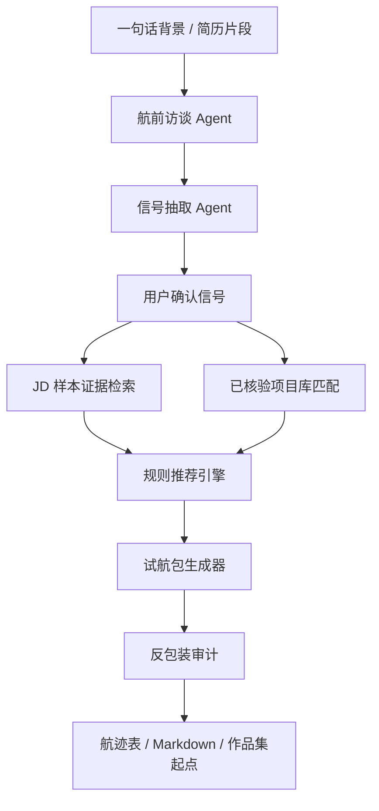

# 寻径星图 P1-C 航前访谈与多项目匹配规划

日期：2026-06-11
主 Agent：产品经理 / 主 Agent

## 1. 产品结论

P1-B.1 已证明“真实背景 -> 规则路径推荐 -> OpenDocuments 试航包”的机制，但仍容易让用户感到是在走固定 Demo 流程。P1-C 的目标是把寻径星图升级为用户愿意主动使用的产品：

> AI 通过结构化访谈挖掘用户真实经历，用户确认后形成可迁移信号，再用规则优先的方式匹配路径和已核验开源项目，生成可追溯试航包。

P1-C 不把 LLM 变成最终裁判。LLM 只做访谈、追问、结构化提取和解释辅助；路径推荐、项目准入、反包装和完整导出仍由规则、数据和审核状态控制。

## 2. 阶段切分

### P1-C.1：航前访谈 + 用户确认信号

第一轮只实现 AI 航前访谈和用户确认信号。

范围：

- 用户输入一句话背景或简历片段。
- AI 按固定访谈框架逐轮追问。
- AI 抽取候选 `UserProfileSignal[]`。
- 用户确认、删除或修改信号。
- 只有确认信号进入路径推荐。
- 项目匹配继续使用已核验项目库。

不做：

- GitHub Search。
- 实时抓取开源项目。
- 未核验项目进入完整试航包。
- LLM 直接决定路径或项目。

### P1-C.2：已核验多项目库匹配

第二轮扩展已核验项目库，让 OpenDocuments 从唯一主线降级为项目库中的一个项目。

范围：

- 增加 10-20 个已核验开源项目。
- 每个项目必须有 License、核验日期、适配路径、风险边界和试航模板。
- 推荐页展示 2-3 个已核验项目匹配。

### P1-C.3：候选项目发现

第三轮再考虑 GitHub Search，但只用于候选发现。

范围：

- 读取 GitHub search / README / License / topics。
- 生成 `needs_review` 候选项目。
- 候选项目不进入用户完整试航包。

## 3. Agentic Workflow

## 4. 模块边界

### 航前访谈 Agent

负责提出问题和追问真实经历，不负责最终推荐。

访谈主题：

- 做过什么项目。
- 在项目中负责什么。
- 面向谁解决问题。
- 处理过什么资料、数据或流程。
- 使用过什么 AI 工具或技术工具。
- 是否有调研、沟通、测试、交付或复盘。
- 求职目标、时间线和限制条件。

### 信号抽取 Agent

负责把对话转成候选用户信号，必须使用结构化 schema。候选信号需要用户确认后才可进入推荐。

### JD 样本证据检索

只从现有 JD 样本和结构化岗位数据中提取趋势参考，不声称市场完整覆盖。

### 已核验项目库匹配

只允许 `approved_for_trial_package` 项目生成完整试航包。P1-C.1 继续使用现有已核验项目库；P1-C.2 再扩展多项目。

### 规则推荐引擎

根据用户确认信号、JD 样本证据、项目证据和风险证据生成路径建议。不得展示分数、百分比、录用概率或能力认证。

### 反包装审计

负责拦截项目归属、能力证明、求职结果判断和生产上线等越界表达。

## 5. 模型边界

允许 LLM：

- 提问。
- 追问。
- 结构化提取候选信号。
- 辅助解释为什么需要用户确认。

不允许 LLM：

- 直接决定最终路径。
- 直接决定可用开源项目。
- 把候选项目变成已核验项目。
- 生成能力认证、录用预测、企业筛选或履历包装表达。

## 6. 下一轮任务

建议先启动四个规划任务：

1. `P1C-PRD-001` / 产品规划B：输出 P1-C PRD、页面流程、字段 schema、验收标准。
2. `P1C-TECH-001` / 技术方案B：输出 Agentic Workflow、API、存储、失败降级和模型调用边界。
3. `P1C-MODEL-001` / 模型方案A：输出模型选型、评测集、成本 / 延迟 / JSON 稳定性方案。
4. `P1C-DATA-001` / 数据方案E：输出已核验多项目库 schema、首批项目筛选标准和 P1-C.1 / C.2 数据边界。

后端、前端和 QA 实现任务应等以上四个规划任务回传并完成 PM merge review 后再启动。
